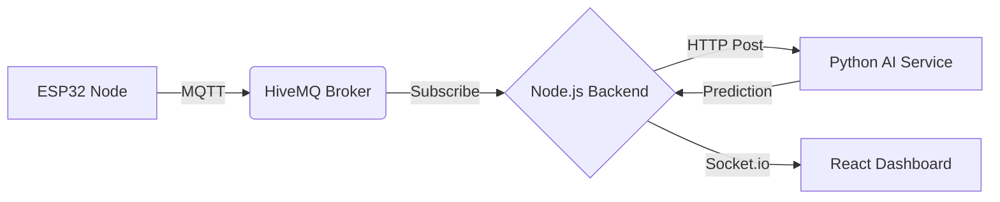

<div align="center">

  
  
  

  <br/><br/>

  # RailGuard Command Center
  ### AI-Powered Real-Time Railway Sabotage Detection System

  <p>
    <a href="#-problem-statement">Problem</a> •
    <a href="#-system-architecture">Architecture</a> •
    <a href="#-tech-stack">Tech Stack</a> •
    <a href="#-installation--setup">Setup</a> •
    <a href="#-how-to-run">Run</a>
  </p>

  
  
  
  
  

</div>

---

## Problem Statement

Railway safety is critical, yet infrastructure is often compromised by sabotage, theft, or tampering. Traditional inspection methods are reactive and intermittent. **RailGuard** provides a **proactive** solution to:

* **Detect** physical tampering (sawing, hammering, removal) in real-time.
* **Analyze** multi-sensor data using Edge AI and Cloud AI.
* **Alert** operators instantly via a geospatial dashboard.

---

## System Architecture

The system follows a linear data pipeline from the physical edge to the operator dashboard.



> **Flow:** Sensors → MQTT Broker → Node Server → AI Inference → Node Server → Dashboard UI

---

## 🛠 Tech Stack

| Domain | Technology | Description |
| --- | --- | --- |
| **Hardware** |  | Edge node collecting Vibration (ADXL345), Magnetic (QMC5883L) & Sound (INMP441) data. |
| **Backend** |  | **Express.js** server acting as the bridge between MQTT, AI, and Frontend. |
| **AI Engine** |  | **FastAPI** service running **Isolation Forest** & Physics-based rules for anomaly detection. |
| **Frontend** |  | **Vite** app with **Leaflet Maps** (OpenRailwayMap) & **Recharts** for live telemetry. |
| **Comms** |  | Low-latency protocol for IoT sensor data transmission. |

---

## Installation & Setup

Follow these steps to set up the system locally.

### Prerequisites

* **Node.js** (v16 or higher)
* **Python** (v3.9 or higher)
* **Git**
* **Arduino IDE** (If deploying to physical hardware)

### 1️ Clone the Repository

```bash
git clone [https://github.com/your-username/railguard-system.git](https://github.com/your-username/railguard-system.git)
cd railguard-system

```

### 2️ Backend Setup (Node.js)

The backend handles MQTT subscriptions and serves the API.

```bash
cd backend/node-server
npm install
# Create a .env file if required (not needed for prototype)

```

### 3️ AI Service Setup (Python)

The intelligence layer that processes sensor data.

```bash
cd backend/node-server/ai-service
# Optional: Create virtual env
# python -m venv venv && source venv/bin/activate
pip install -r requirements.txt

```

### 4️ Frontend Setup (React)

The command center dashboard.

```bash
cd frontend
npm install

```

---

## How to Run

To run the full system, you need **three separate terminal windows**.

#### Terminal 1: The Brain (AI Service)

```bash
# Path: backend/node-server/ai-service
python -m uvicorn main:app --reload --port 5000

```

> *Output:* `AI Model Loaded Successfully`

#### Terminal 2: The Bridge (Node Backend)

```bash
# Path: backend/node-server
node index.js

```

> *Output:* `Server running...` and `Connected to MQTT Broker`

#### Terminal 3: The Interface (Dashboard)

```bash
# Path: frontend
npm run dev

```

> *Output:* `➜ Local: http://localhost:5173/`

---

## 🧪 Testing the System

1. **Open Dashboard:** Navigate to `http://localhost:5173`.
2. **Select Mode:** Choose **TEST (SIM)** mode from the header dropdown to simulate data without hardware.
3. **Simulate Threat:** The simulation will generate random vibration data.
4. **Hardware Test:** If using ESP32, switch to **LIVE** mode and shake the sensor to trigger a `RED ALERT` on the map.

---

<div align="center">
<b>Built for Smart India Hackathon / Railway Safety Projects 🇮🇳</b>


<sub>RDSO Compliant Logic • Indigenous Technology • Make in India</sub>
</div>

```