```markdown
<div align="center">

  
  
  

  <br/><br/>

  # 🚆 RailGuard Command Center
  ### AI-Powered Real-Time Railway Sabotage Detection System

  <p>
    <a href="#-problem-statement">Problem</a> •
    <a href="#-system-architecture">Architecture</a> •
    <a href="#-tech-stack">Tech Stack</a> •
    <a href="#-installation--setup">Setup</a> •
    <a href="#-how-to-run">Run</a>
  </p>

  
  
  
  
  

</div>

---

## 🚀 Problem Statement

Railway safety is critical, yet infrastructure is often compromised by sabotage, theft, or tampering. Traditional inspection methods are reactive and intermittent. **RailGuard** provides a **proactive** solution to:

* 🔍 **Detect** physical tampering (sawing, hammering, removal) in real-time.
* 🧠 **Analyze** multi-sensor data using Edge AI and Cloud AI.
* 🚨 **Alert** operators instantly via a geospatial dashboard.

---

## 🔄 System Architecture

The system follows a linear data pipeline from the physical edge to the operator dashboard.

```mermaid
graph LR
    A[ESP32 Node 📡] -->|MQTT| B(HiveMQ Broker ☁️)
    B -->|Subscribe| C{Node.js Backend ⚙️}
    C -->|HTTP Post| D[Python AI Service 🧠]
    D -->|Prediction| C
    C -->|Socket.io| E[React Dashboard 🖥️]

```



> **Flow:** Sensors → MQTT Broker → Node Server → AI Inference → Node Server → Dashboard UI

---

## 🛠 Tech Stack

| Component | Technology Used | Purpose |
| --- | --- | --- |
| **Hardware** | ESP32, ADXL345, QMC5883L | Edge processing & sensing (Vibration, Mag, Sound) |
| **Communication** | MQTT (HiveMQ), Socket.io | Real-time data telemetry |
| **Backend** | Node.js, Express | Orchestration & API handling |
| **AI Brain** | Python, FastAPI, Scikit-learn | Anomaly detection (Isolation Forest) |
| **Frontend** | React, Recharts, Leaflet | Visualization & Map Interface |

---

## ⚙️ Installation & Setup

### Prerequisites

### 1. Clone the Repository

```bash
git clone <your-repo-url>
cd <your-repo-name>

```

### 2. Install Dependencies

**🖥️ Frontend**

```bash
cd Software/frontend
npm install

```

**⚙️ Backend**

```bash
cd ../backend/node-server
npm install

```

**🧠 AI Service**

```bash
cd ai-service
pip install -r requirements.txt

```

---

## 🏃‍♂️ How to Run

You need **3 Terminal Windows** running simultaneously.

#### 1️⃣ Terminal 1: The Brain (AI)

```bash
# Path: backend/node-server/ai-service
python -m uvicorn main:app --reload --port 5000

```

> *Expect:* `✅ AI Model Loaded`

#### 2️⃣ Terminal 2: The Bridge (Backend)

```bash
# Path: backend/node-server
node index.js

```

> *Expect:* `🚀 Server running...` and `✅ Connected to MQTT`

#### 3️⃣ Terminal 3: The Face (Frontend)

```bash
# Path: frontend
npm run dev

```

> *Expect:* `➜ Local: http://localhost:5173/`

---

## 🧪 Testing the System

<div align="center">


<em>(Replace this link with a screen recording of your dashboard!)</em>
</div>

1. Open **`http://localhost:5173`**.
2. Toggle Mode to **TEST (SIM)** if hardware isn't connected.
3. **Trigger:** Shake your sensor or click "Simulate Anomaly".
4. **Observe:** The graph spikes 📈, the Map Marker turns **RED** 🔴, and the Event Log updates.

---

## 📂 Project Structure

```bash
Software/
├── 📂 frontend/          # React Dashboard (Vite)
│   ├── src/pages/        # Dashboard.jsx
│   └── src/assets/       # Logos (IR, MakeInIndia)
├── 📂 backend/
│   └── 📂 node-server/   # Main Controller
│       ├── 📂 ai-service/# Python FastAPI (The Brain)
│       ├── 📂 mqtt/      # MQTT Connection Logic
│       └── index.js      # Entry Point

```

---

<div align="center">
<b>Built for Smart India Hackathon / Railway Safety Projects 🇮🇳</b>


<sub>RDSO Compliant Logic • Indigenous Tech</sub>
</div>

```

-----

### **2. Bonus: "Attractive" Startup Script (`banner.js`)**

You asked for a "js file to it." To make your backend terminal look cool (like a real hacking tool/government system) when you start it, create this file in your backend.

**File:** `backend/node-server/utils/banner.js`

```javascript
// A simple script to print a cool banner when the server starts
const printBanner = () => {
    console.log('\x1b[36m%s\x1b[0m', `
    ======================================================
      _____       _ _  _____1uard   
     |  __ \\     (_) |/ ____|                   
     | |__) |__ _ _| | |  __ _   _  __ _ _ __ __| |
     |  _  // _\` | | | | |_ | | | |/ _\` | '__/ _\` |
     | | \\ \\ (_| | | | |__| | |_| | (_| | | | (_| |
     |_|  \\_\\__,_|_|_|\\_____|\\__,_|\\__,_|_|  \\__,_|
                                                    
     🚆 RAILWAY TAMPERING DETECTION SYSTEM v1.0
     🇮🇳 MINISTRY OF RAILWAYS | RDSO COMPLIANT
    ======================================================
    `);
    console.log('\x1b[33m%s\x1b[0m', `[INFO] Initializing System Modules...`);
};

module.exports = printBanner;

```

**How to use it:**
In your `backend/node-server/index.js`, add this at the very top:

```javascript
const printBanner = require('./utils/banner'); // Import the file

printBanner(); // Call it before your server starts

// ... rest of your server code ...

```